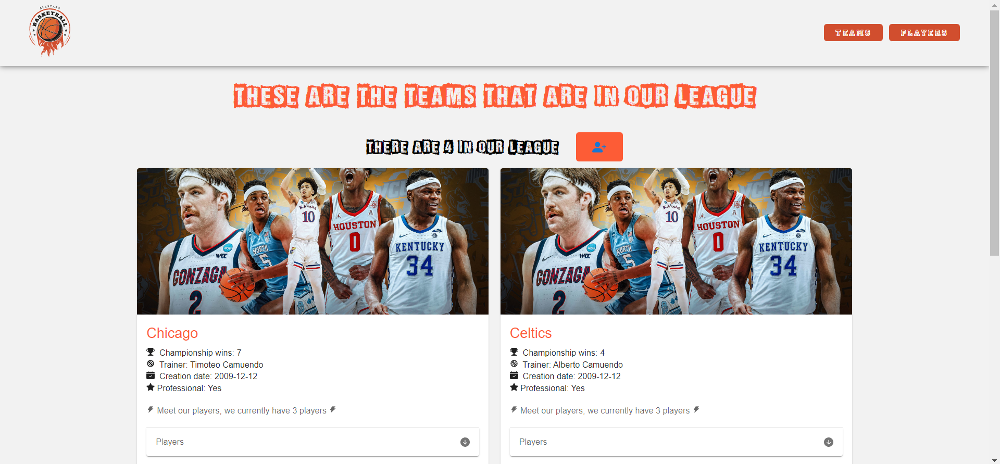
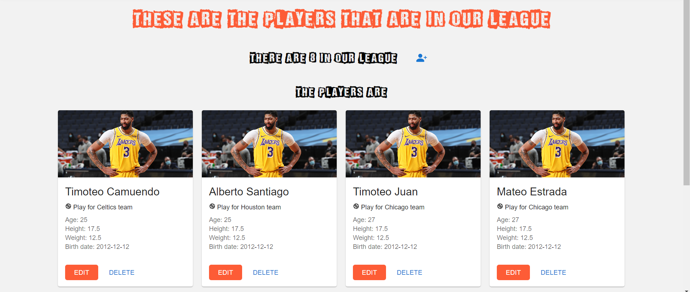

# Examen segundo bimestre

---
## Aplicaciones web avanzadas
### Desarrollado por: `Timoteo Camuendo` - `2023`

---

#### Descripción
Aplicación web que permite la gestión de equipos de basketball. Se puede crear, editar, eliminar y listar equipos. Además, se puede crear, editar, eliminar y listar jugadores. Los jugadores pertenecen a un equipo.

Implementa un CRUD completo para los equipos y jugadores.
UI desarrollada con NextJS y TailwindCSS, contando con un diseño responsivo,
fácil de usar.

#### Equipos

Se gestiona la información de los equipos, como el nombre,
campeonatos ganados, jugadores, etc.

#### Jugadores

Se gestiona la información de los jugadores, como el nombre,
edad, altura, peso, etc.

---
#### Tecnologías utilizadas
1. React
2. Node
3. NestJS
4. NextJS
5. Sqlite3
6. TypeORM

---
#### Instrucciones
1. Clonar el repositorio
2. Ejecutar `npm install` en la carpeta `examen-segundo-bimestre`
3. Ejecutar `npm run start` en la carpeta `examen-segundo-bimestre\backend-equipo-bascket`
4. Ejecutar `npm run dev` en la carpeta `examen-segundo-bimestre\frontend-equipo-bascket`
5. Abrir el navegador en `http://localhost:3000`