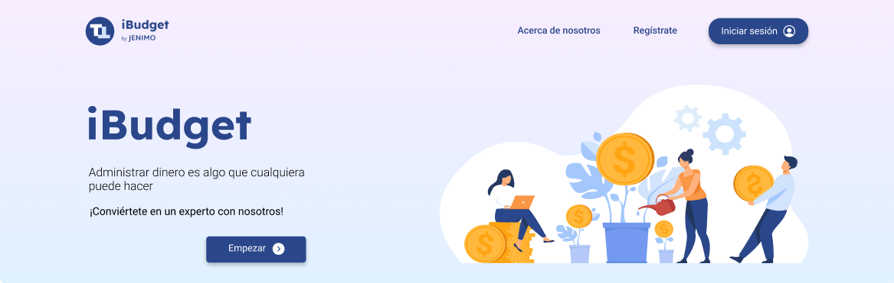

<h1>Proyecto bimestral</h1>
<h2> iBudget</h2>

<h3>Descripción general</h3>

iBudget es una aplicación web permite a sus usuarios registrar sus entradas y salidas de dinero. Además, que puedan registrar sus metas de ahorro y deudas de tal manera que puedan conocer sus avances.

<h3>Entregables</h3>
<ul>
<li><a href="https://epnecuador-my.sharepoint.com/:w:/g/personal/jenny_llano_epn_edu_ec/ETii0MSHvLFPqsuZXpo3X20Bw_UtpTlclCGwQkVuyRcLIw?e=vfhvDW">Acta del proyecto con historias de usuario</a></li>
<li><a href="https://www.figma.com/file/tmuLf7HnDyRK0m33vAu2x9/iBudget?node-id=0%3A1&t=V6Av44LK482WoCKN-1">Prototipos en figma</a></li>
<li><a href="https://lucid.app/lucidchart/b0eef51e-c73c-428d-a7a0-983ed74842a9/edit?viewport_loc=-192%2C-723%2C2220%2C1038%2C0_0&invitationId=inv_e52974cc-fdaa-4c4e-be67-62d3da8a2b98">Modelo relacional </a></li>
</ul>